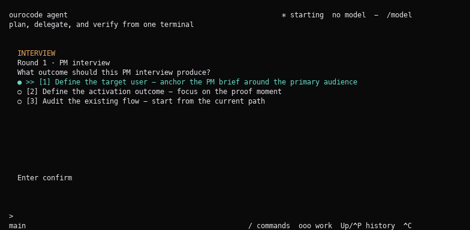

# Ourocode



Ourocode is a terminal-native AI workbench for running structured agent workflows without leaving your shell. It combines a raw terminal UI, MCP/Ouroboros workflow orchestration, wonderTool decision checkpoints, local command discovery, and model backends such as Claude CLI, Codex CLI, Gemini CLI, and ChatGPT/Codex OAuth.

The project is currently optimized for local macOS development and early user testing.

## What It Does

- Runs `ooo` workflows from an interactive terminal session.
- Turns interview questions into focused wonderTool pickers with arrow-key navigation, free answers, pause/resume, and visible loading states.
- Keeps MCP parent/child runtime state, session streams, and workflow progress visible in terminal panes.
- Provides command discovery with `/`, `ooo`, `@file`, and `@mcp:` style prompt overlays.
- Supports readline-style editing keys, prompt history, pasted image file tokens, and terminal resize/zoom recovery.
- Builds as an Elixir `escript` plus a small Rust tty helper.

## Quick Start

Install the latest prerelease build:

```bash
curl -fsSL https://raw.githubusercontent.com/Q00/ourocode/release/bootstrap/install.sh | bash
```

Then run:

```bash
ourocode
```

Optional model backends:

- Claude CLI
- Codex CLI
- Gemini CLI
- ChatGPT/Codex login

For a local source checkout:

```bash
./install.sh
ourocode
```

Detect available model backends:

```bash
./ourocode --detect
```

Inside the TUI:

```text
/model          choose a model backend
/login          sign in for ChatGPT/Codex OAuth
ooo interview   start a structured interview flow
ooo help        see workflow commands
@               mention project files
Ctrl-G          show active key help
```

## Install Locally

Install from GitHub without cloning:

```bash
curl -fsSL https://raw.githubusercontent.com/Q00/ourocode/release/bootstrap/install.sh | bash
ourocode
```

`install.sh` downloads the matching GitHub Release tarball, installs `ourocode` into `~/.local/ourocode/<version>`, and writes a launcher at `~/.local/bin/ourocode`. The launcher sets `OUROCODE_TTY` so the installed escript can find the bundled native tty helper.

When run from a source checkout, the same installer uses bundled release binaries if present, or builds from source when needed. Set `OUROCODE_BUILD_FROM_SOURCE=1` to force a local build.

Set `OUROCODE_SKIP_OUROBOROS=1` to skip the best-effort Ouroboros install step.

## Package A Release

Build a local release tarball:

```bash
./scripts/package.sh
```

The release contains:

```text
ourocode
bin/ourocode_tty
install.sh
README.md
```

Generated artifacts:

```text
dist/ourocode-v0.1.0-darwin-arm64.tar.gz
dist/ourocode-v0.1.0-darwin-arm64.tar.gz.sha256
```

Install from an unpacked release:

```bash
tar -xzf dist/ourocode-v0.1.0-darwin-arm64.tar.gz
cd ourocode-v0.1.0-darwin-arm64
./install.sh
ourocode
```

The next distribution channel should be a Homebrew tap:

```bash
brew tap Q00/ourocode
brew install ourocode
```

Longer term, Ourocode should move toward a single self-contained binary or app bundle so users do not need to install Elixir/Rust just to run it.

## Architecture

```text
Terminal TUI
  -> command registry and prompt overlays
  -> runtime dispatcher
  -> MCP transport layer
  -> Ouroboros / model backends
  -> journaled event stream
  -> dashboard projections
```

Key areas:

- `lib/ourocode/terminal/` - raw terminal UI, key decoding, palette, prompt history, screen diffing
- `lib/ourocode/runtime/` - workflow orchestration, dispatch, focus state, stream supervision
- `lib/ourocode/mcp/` - stdio, SSE, and streamable HTTP normalization
- `lib/ourocode/wonder_tool/` - decision request parsing and answer capture
- `lib/ourocode/dashboard/` - data-only pane projections
- `rust/ourocode_ipc/` - native tty helper

## Development

Run tests:

```bash
mix test
```

Run focused terminal tests:

```bash
mix test test/ourocode/terminal
```

Build everything:

```bash
./build.sh
```

## Status

This is an early release branch for getting real users onto the terminal workflow. The current priority is packaging, installer polish, and feedback from actual interview/wonderTool sessions.
